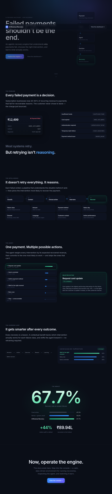
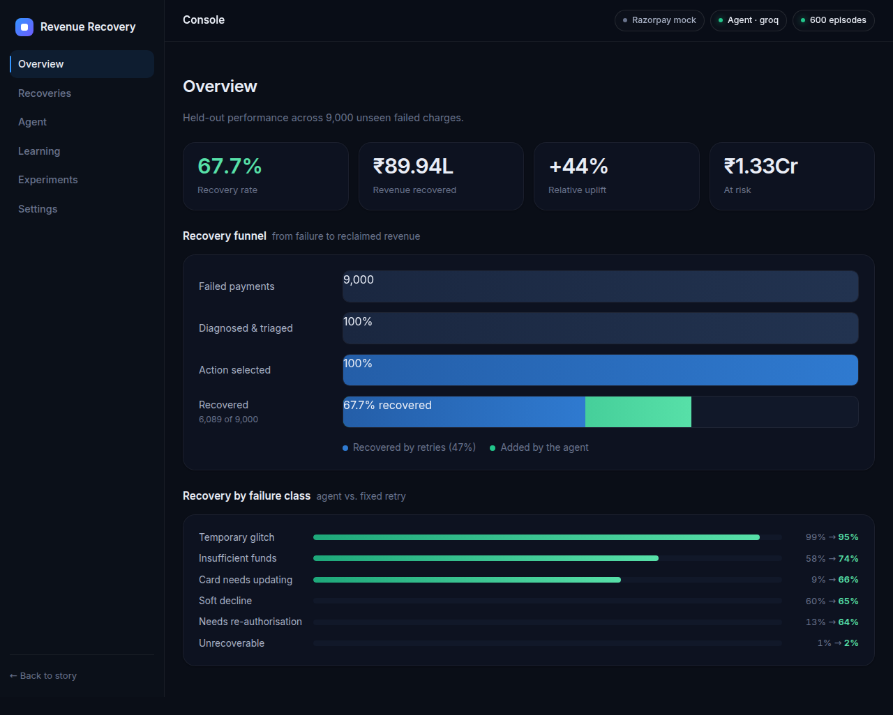
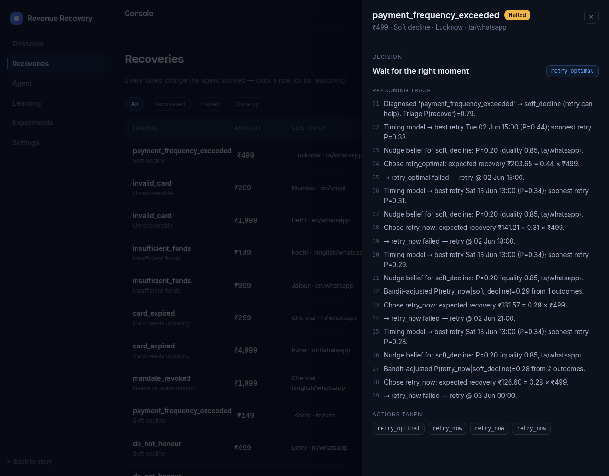

<div align="center">

# ♻️ AI Revenue Recovery

### An agentic engine that recovers failed recurring payments on Razorpay

**Razorpay AI Buildathon 2026 — Track 3: AI Revenue Recovery**

*Diagnose → Predict → Decide → Act → Measure — a closed loop that turns involuntary churn back into revenue.*

</div>

---

## The experience

The product ships as two deliberately distinct surfaces. A **cinematic, scroll-driven story** explains the problem and the intelligence — then a calm, data-driven **operating console** where you actually run recoveries.



Story mode (`/`) → **Enter the console →** → operating mode (`/dashboard`): Overview, Recoveries, Agent, Learning, Experiments, Settings.



Every recovery opens a drawer with the agent's full reasoning trace — a decision log, not a debug dump.



---

## The problem

Subscription and recurring businesses lose **20–40% of recurring revenue to *involuntary* churn** — payments that fail for *recoverable* reasons: insufficient funds on debit day, an expired card, a bank in downtime, a soft "do-not-honour" decline, a UPI-autopay mandate hiccup. The customer never *chose* to leave; the payment just didn't go through.

Today the default response is blunt:

- **Fixed-schedule retries.** Razorpay auto-retries the next day. One dumb retry, same time, for every failure — whether the card is expired (retrying is pointless) or the customer is simply mid-month broke (retry on salary day and it sails through).
- **Generic dunning.** A single templated "your payment failed" email in English, to everyone, regardless of *why* it failed or *who* the customer is.

The state of the art (Stripe Smart Retries, Butter, FlyCode) uses ML to pick the optimal retry moment per card and orchestrate smarter dunning — and recovers meaningfully more. **There is no open, transparent, India-native version of this.** That's what this project is.

## The idea in one loop

For **every** failed recurring charge, an agent runs a closed decision loop:

```
  payment.failed ─▶  ┌───────────┐   ┌──────────┐   ┌──────────┐   ┌────────┐   ┌──────────┐
  (Razorpay          │ DIAGNOSE  │─▶ │ PREDICT  │─▶ │  DECIDE  │─▶ │  ACT   │─▶ │ MEASURE  │
   webhook)          │ taxonomy  │   │  ML: P(  │   │ agentic  │   │ retry /│   │ outcome  │
                     │ of failure│   │ recover),│   │ policy   │   │ dunning│   │ feeds    │
                     │ reason    │   │ best slot│   │ (bandit) │   │ + link │   │ back ↺   │
                     └───────────┘   └──────────┘   └──────────┘   └────────┘   └──────────┘
```

1. **Diagnose** — consume `payment.failed` / `subscription.halted` webhooks and map raw Razorpay error reason codes into a *recoverability taxonomy* (soft-retry vs. needs-card-update vs. needs-reauth vs. hard-decline vs. transient).
2. **Predict** — an ML model scores each failure: `P(recover)`, the **optimal retry time** (day-of-week × hour, salary-cycle aware), and expected time-to-recover.
3. **Decide** — a contextual-bandit **policy** picks the action per customer to maximise *expected recovered revenue*: retry-now, retry-at-best-slot, switch payment method, dunning nudge, request card update, or offer a grace link.
4. **Act** — generate a **personalised, multilingual dunning message** (Claude, with a deterministic fallback) and attach a **real Razorpay test-mode Payment Link** for one-tap recovery; dispatch on the best channel (email / WhatsApp / SMS).
5. **Measure** — a simulator + **held-out evaluation** proves the uplift in recovery rate and rupees recovered versus naive baselines. Every decision is logged as an explainable **agent trace**.

## Why this wins Track 3

| Judging signal | How we hit it |
|---|---|
| *"Something real, measured on a held-out test set"* (the buildathon's stated bar) | Reproducible eval: engine vs. 3 baselines on a frozen holdout, reporting recovery rate, ₹ recovered, days-to-recover, and prediction AUC. |
| Genuine AI, not a CRUD dunning tool | Trained ML for recovery-probability + optimal-timing, a learning bandit policy, and an LLM dunning writer — each carrying its weight. |
| Defensible architecture | Webhook signature verification, idempotent case handling, decoupled diagnose/predict/decide/act stages, deterministic fallbacks everywhere. |
| **India-native** (what a Stripe clone can't claim) | Salary-cycle-aware retry timing, UPI-autopay mandate handling, Hindi/English/regional dunning. |
| Uses Razorpay's own platform | Test-mode Customers, Orders, Payment Links, and webhooks; recovers a **real** test payment live in the demo. |

## Architecture

```
src/recovery/
├── domain/        Pydantic models + Razorpay-grounded failure taxonomy
├── simulation/    Synthetic subscription population + recovery environment (ground truth)
├── ml/            Feature engineering, P(recover) + optimal-timing models, training
├── policy/        Contextual-bandit action policy + the agentic orchestration loop
├── llm/           Claude dunning-message generator (+ deterministic fallback)
├── razorpay/      Test-mode gateway wrapper + webhook verification (+ mock)
├── eval/          Baselines + held-out evaluation harness
└── api/           FastAPI backend (webhooks, cases, metrics, live stream)
frontend/          React/Vite analytics dashboard
scripts/           generate_data · train_models · run_eval · demo_live
```

## Quickstart

```bash
make install     # Python deps
make all         # simulate → train → eval  (runs with ZERO credentials)
make api         # FastAPI backend on :8000
make frontend    # React dashboard (separate terminal)
```

No keys are required to run the full pipeline — the engine falls back to a faithful
mock gateway and a deterministic multilingual dunning writer. Add keys in `.env`
(see `.env.example`) to enable the **live** test-mode recovery demo and LLM-authored
messages. The LLM is used **only** for message copy (`LLM_PROVIDER` = `anthropic` /
`groq` / `openai`); evaluation always uses templates, so a key never changes the
measured results.

## Results

On **9,000 unseen failed recurring charges** (a held-out population the models never
trained on), every policy facing the *identical* hidden ground truth:

| Policy | Recovery rate | Revenue recovered | Retries used |
|---|---|---|---|
| No recovery (floor) | 0.0% | ₹0 | 0 |
| Fixed next-day retry *(Razorpay default)* | 47.1% | ₹63.5L | 26,361 |
| Fixed retry + generic email | 53.2% | ₹72.0L | 25,122 |
| **AI Revenue Recovery engine** | **67.7%** | **₹89.9L** | **13,012** |

**+20.6 points (+44% relative) over the fixed-retry default, +₹26.4L recovered — with
roughly half the bank retries.** It waits for the payday window instead of hammering,
and wins biggest exactly where a blind retry is useless:

| Failure class | Fixed retry | Engine |
|---|---|---|
| Expired card (needs update) | 8.6% | **65.6%** |
| Paused/revoked mandate (needs re-auth) | 12.6% | **64.4%** |
| Insufficient funds | 58.5% | **73.7%** |


Numbers are reproduced by `make eval` on seed `9999`; full methodology and the
bandit's learned policy are in [`docs/RESULTS.md`](docs/RESULTS.md).

## Documentation

- [`docs/ARCHITECTURE.md`](docs/ARCHITECTURE.md) — how each stage works and why.
- [`docs/RESULTS.md`](docs/RESULTS.md) — evaluation methodology + measured uplift.
- [`docs/PITCH.md`](docs/PITCH.md) — the 5-minute pitch + demo runbook.

---

<div align="center">
<sub>Built for the Razorpay AI Buildathon 2026 · Track 3 · Simulation-first, credential-optional.</sub>
</div>
