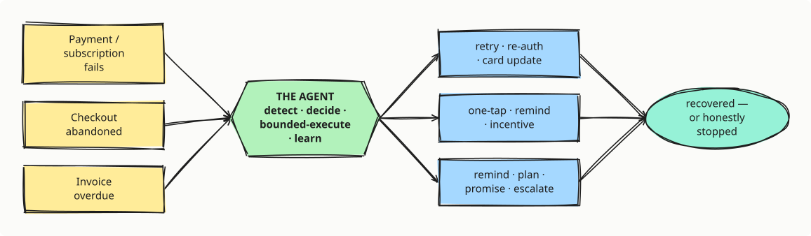
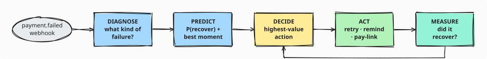
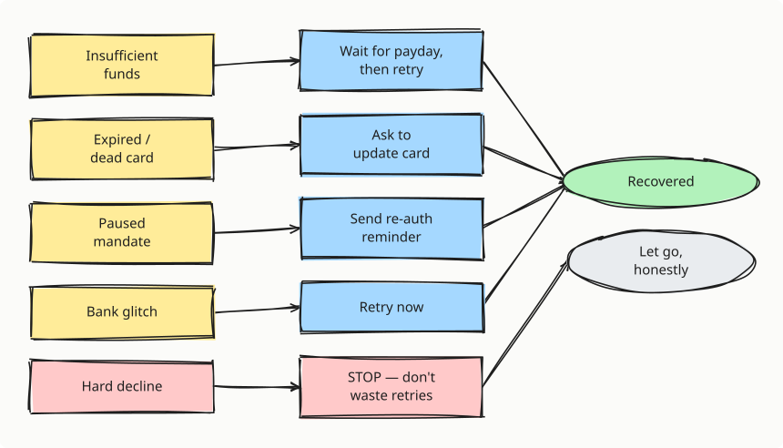
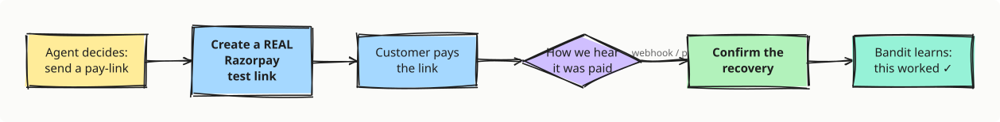
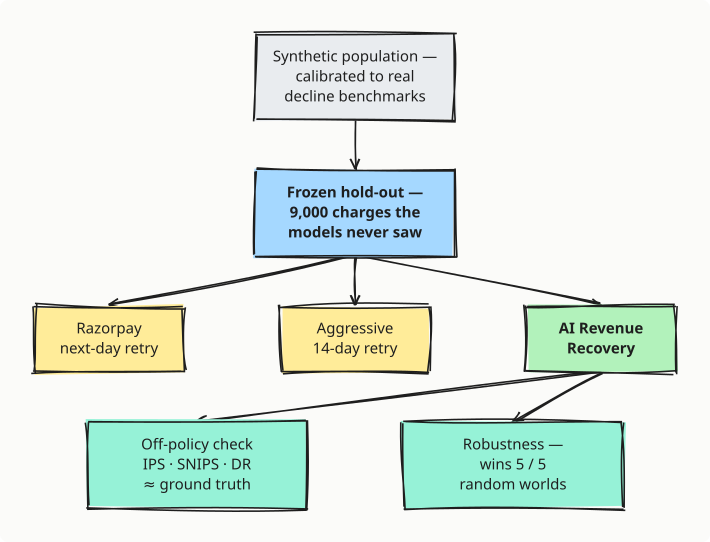
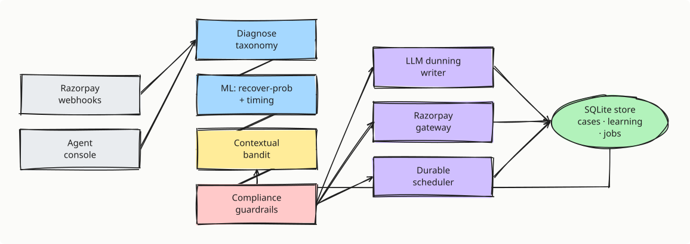

<div align="center">

# ♻️ AI Revenue Recovery

### An agent that wins back revenue at risk across the funnel — on Razorpay

*Failed payments · abandoned checkouts · overdue invoices — one agent, measured on each.*

**Razorpay AI Buildathon 2026 — Track 3**

*Everyone maximises recovery **rate** — the wrong number. This agent recovers more money with **half the bank retries**, because it optimises what the merchant **keeps**, not gross volume.*

</div>

---

## 📖 Read this first — what is this, in plain English?

Imagine you run a subscription business — a music app, a SaaS tool, a gym. Every month you auto-charge your customers' cards or UPI. **Some of those charges fail** — the card expired, there wasn't enough money on that particular day, the bank had a hiccup, a UPI mandate got paused.

Here's the painful part: **the customer never decided to leave.** They still want the service. The *payment* just didn't go through. This silent, accidental loss is called **involuntary churn**, and it quietly bleeds **20–40% of recurring revenue** out of subscription businesses.

What does everyone do about it today? Something dumb: **retry the exact same charge tomorrow, at the same time, for every failure.** Retrying an *expired card* is pointless. Retrying an *empty account* mid-month is pointless. But retrying that same empty account *on the customer's salary day* would sail through — and nobody bothers to figure that out.

**This project is an AI agent that figures it out — for every single failed charge.** It looks at *why* the payment failed, predicts the smartest way (and moment) to win it back, does it, learns from what happened, and — crucially — **knows when to stop** instead of annoying a good customer or burning money on a hopeless case.

> 💡 **The one idea to remember:** *recovery rate* (how many charges you claw back) is the wrong scoreboard. It ignores the **cost** of clawing them back — bank retries have fees and penalties, and pestering customers makes them cancel for real. This agent optimises **net value**: money recovered *minus* the cost to recover it. It ends up recovering **more money with far less effort.** That's the whole thesis: **value, not volume.**

---

## 🩸 The problem, a little deeper

A recurring payment can fail for many reasons, and they are **not** the same problem:

| What happened | Retrying blindly is… | The smart move |
|---|---|---|
| No money in the account today | …a coin flip | Wait for **salary day**, then retry |
| Card expired / blocked | …useless | Ask the customer to **update the card** |
| UPI mandate paused | …useless | Send a **re-authorisation** nudge |
| Bank had a momentary glitch | …fine, but mistimed | Retry **now** (or in 20 min) |
| Card reported stolen | …useless & annoying | **Stop.** Don't waste retries |

The market leaders (Stripe Smart Retries, Butter, FlyCode) use machine learning to pick a better retry moment and recover meaningfully more. **But there is no open, transparent, India-native version of this** — one that understands salary cycles, UPI-autopay mandates, regional-language reminders, and India's payment regulations. That gap is what this project fills.

---

## 🕸️ One agent, the whole funnel

Revenue doesn't leak in one clean step — a payment degrades, a checkout is abandoned, an invoice goes overdue. The **same** agent handles all three. Only the *trigger* and the *intervention menu* change; the loop — **detect the risk → determine the right intervention → run a bounded recovery workflow → learn** — is identical.

<p align="center"></p>

<sub>*<a href="docs/diagrams/funnel.excalidraw">edit this diagram in Excalidraw</a>*</sub>

Each source clears the **same Track-3 bar** — measured money recovered across a batch, compliant escalation, a stopping rule, and an audit trail:

| Revenue-at-risk source | At risk | Recovered | Measured by |
|---|---|---|---|
| **Payment & subscription failures** | ₹1.33Cr | **₹91.05L** | trained ML + held-out eval (9,000 charges) |
| **Checkout abandonment** | ₹38.29L | **₹18.40L**  ·  +13 pts | batch of 800 vs one-size-fits-all |
| **Overdue receivables** | ₹3.79Cr | **₹2.89Cr**  ·  +13 pts | batch of 800 vs one-size-fits-all |
| **Combined** | **₹5.51Cr** | **₹3.98Cr** | one agent, three sources |

Payment failures carry the deepest rigor (trained models, off-policy evaluation, 5/5-worlds robustness); checkout & receivables run the *same* detect→decide→bounded-execute loop on their own measured batches, calibrated to public benchmarks (cart-abandonment ~70%, AR aging-bucket recovery). **The rest of this README drills into the deepest domain — payment failures.**

---

## 🔁 How it works — the closed loop

For **every** failed charge, the agent runs the same five-step loop. Think of it as a tiny, tireless recovery analyst working each case:

<p align="center"></p>

<sub>*<a href="docs/diagrams/loop.excalidraw">edit this diagram in Excalidraw</a>*</sub>

**In plain terms:**

1. **Diagnose** — read Razorpay's error code and sort the failure into a *type* (no-funds, dead-card, paused-mandate, bank-glitch, hard-decline). Different types need completely different treatment.
2. **Predict** — two small ML models score the case: *how likely is this to recover?* and *when is the best moment to try?* (salary-cycle aware).
3. **Decide** — the agent picks the single action with the best **expected value** — the money it would win, weighted by the chance it works and the customer's future worth, *minus* the cost of trying. (More on the "brain" below.)
4. **Act** — it schedules the retry for the right moment, and/or writes a friendly reminder in the customer's language with a one-tap payment link.
5. **Measure** — when the outcome comes back (paid or not), the agent **learns** — so next time it's a little smarter for that kind of case.

---

## 🌳 What the agent actually decides

The magic isn't "retry harder" — it's routing each *kind* of failure to the *right* action, and **stopping** on the hopeless ones:

<p align="center"></p>

<sub>*<a href="docs/diagrams/routing.excalidraw">edit this diagram in Excalidraw</a>*</sub>

> 💡 Knowing **when to stop** is as valuable as knowing when to act. Every needless retry costs a bank fee, risks a penalty on your merchant account, and nudges a good customer toward cancelling for real. A system that only ever "tries harder" is optimising the wrong thing.

---

## 🔌 Closing the loop for real (not a simulation)

The agent doesn't just *simulate* recovery — it closes one **real** loop through Razorpay's live test API, with **no webhook tunnel required**:

<p align="center"></p>

<sub>*<a href="docs/diagrams/realloop.excalidraw">edit this diagram in Excalidraw</a>*</sub>

**In plain terms:** the agent creates an actual Razorpay test-mode payment link; the customer pays it; we find out either from a **webhook** (Razorpay pushes us the event) or by **polling** the link's status (we ask Razorpay "was it paid?"). Either way, the case closes with a real captured payment ID, and the agent learns. *The batch of 9,000 charges is synthetic by design (Track 3 asks for exactly that) — but the loop that works it is real.*

---

## 🧠 The brain — how it decides (and learns)

Three parts, each carrying real weight (this is **not** an LLM wrapper):

- **ML models** (gradient-boosted trees) estimate `P(recover)` and the optimal retry slot from features of the failure and customer.
- **A contextual bandit** (Thompson sampling + a LinUCB variant) is the actual **decision-maker**. It maintains a belief about how well each *action* works for each *failure type*, and it improves that belief from **every confirmed outcome**. This learning is **saved to disk**, so it compounds across restarts instead of resetting.
- **An LLM** (`anthropic` / `groq` / `openai`, with a deterministic template fallback) does two things: it writes the **personalised, multilingual reminder** copy, and it **explains the decision** in plain language — grounded in the real numbers, never inventing them.

> 🎓 **What's a "contextual bandit"?** Imagine a row of slot machines where each lever pays out differently *depending on the situation* (the "context" = the failure type). The bandit's job is to learn, from experience, which lever to pull in each situation to make the most money — balancing "exploit what's worked" against "explore to keep learning." It learns from **rewards** (did the recovery succeed?), which is exactly what we observe. That's why the agent gets smarter with use.

Critically, the **ML + bandit make the decision** (the part that's measured and defensible); the **LLM only explains and phrases it.** So turning the LLM on or off never changes the measured results — a key honesty property.

---

## ⚖️ India-native compliance — enforced, not claimed

A system that auto-retries mandates and messages customers in India **must** respect real regulation. This is enforced in code (not a badge on a slide):

- **RBI / UPI-Autopay 24h pre-debit notice** — an auto-retry on a mandate can't fire sooner than *now + 24 hours*.
- **₹15,000 AFA cap** — a silent auto-debit above ₹15,000 isn't permitted; the agent routes it to an **authenticated** payment link instead of retrying.
- **TRAI / DLT messaging** — quiet hours (no 21:00–08:00 sends), a frequency cap, and a consent/DND check.

In the **Agent** tab you can watch this live: set a charge to ₹18,000 on a UPI-autopay mandate and the agent **blocks** the silent retry on the AFA cap, in front of you.

---

## 🔬 How we know it actually works

Claims are cheap. Here's the measurement pipeline that backs every number:

<p align="center"></p>

<sub>*<a href="docs/diagrams/measurement.excalidraw">edit this diagram in Excalidraw</a>*</sub>

**Three layers of proof, in plain terms:**

1. **Fair head-to-head.** Every policy faces the *same* 9,000 hidden failures. The engine isn't compared to a strawman — it's compared to Razorpay's real default *and* to an aggressive retrier that gets 5× more attempts.
2. **Off-policy evaluation.** This is how Stripe/Adyen validate a policy *before* risking a live A/B test: estimate the engine's value purely from a *random* policy's logged data. Our estimators (Doubly-Robust, SNIPS) land within **~1 point** of the true value — proof the method is sound, not hand-waved.
3. **Robustness across worlds.** The strongest answer to *"you rigged the simulator."* We re-run the whole evaluation across **5 randomised failure worlds** (payday crunch, fraud spike, mandate lapses, …) we didn't hand-pick. The engine **wins all 5**, uplift **+23.8 ± 6.5 points** (worst world still +17.5). We tried to break our own result and couldn't.

### 📊 The results

On **9,000 unseen failed charges**, every policy facing identical hidden ground truth:

| Policy | Recovery rate | Revenue recovered | Bank retries | **Net value** |
|---|---|---|---|---|
| No recovery *(floor)* | 0.0% | ₹0 | 0 | ₹0 |
| Razorpay next-day retry *(default)* | 47.1% | ₹63.50L | 26,361 | ₹62.45L |
| Aggressive 14-day retry *(fair control)* | 58.4% | ₹78.10L | 67,499 | ₹75.40L |
| Retry + language-matched dunning | 56.8% | ₹75.89L | 24,385 | ₹74.90L |
| **🏆 AI Revenue Recovery** | **67.8%** | **₹91.05L** | **12,906** | **₹90.51L** |

**+20.7 points and +₹27.55L over Razorpay's default — with roughly half the bank retries.** It even beats the *aggressive* 14-day retrier (58.4%) while using **5× fewer retries**. On **net value** — money recovered *minus* the ~₹4/retry + messaging cost to get it — the gap is even wider: **₹90.51L vs ₹75.40L.** *Value, not volume.*

It wins biggest exactly where blind retry is useless:

| Failure class | Razorpay retry | **Engine** |
|---|---|---|
| Expired card *(needs update)* | 9% | **66%** |
| Paused mandate *(needs re-auth)* | 13% | **64%** |
| Insufficient funds | 58% | **74%** |

> Reproduce every number with `make eval` (seed `9999`). Full methodology in [`docs/RESULTS.md`](docs/RESULTS.md).

---

## 🏗️ System architecture

How the pieces fit together — inputs on the left, the decision brain in the middle, acting on the right, with learning that persists:

<p align="center"></p>

<sub>*<a href="docs/diagrams/architecture.excalidraw">edit this diagram in Excalidraw</a>*</sub>

```text
src/recovery/
├── domain/        Data models + Razorpay-grounded failure taxonomy
├── simulation/    Synthetic subscription population + recovery environment (ground truth)
├── ml/            Feature engineering, P(recover) + optimal-timing models, training
├── policy/        Expected-value orchestrator + Thompson bandit + LinUCB contextual bandit
├── llm/           Dunning-message writer + decision-reasoning writer (+ deterministic fallback)
├── razorpay/      Test-mode gateway, executor + signed webhook verification
├── eval/          Baselines + held-out harness + off-policy (IPS/SNIPS/DR) evaluation
├── compliance.py  RBI e-mandate / UPI-Autopay / TRAI DLT guardrails
├── store.py       SQLite: durable cases + persisted bandit + scheduled jobs
├── scheduler.py   Executes retry/nudge jobs at the compliant time (closes the loop)
├── live.py        Streaming live-campaign engine (SSE): engine vs baseline race
├── risksources.py Checkout-abandonment + overdue-receivable agents (measured batches)
└── api/           FastAPI backend (webhooks, cases, metrics, risk overview, SSE stream)

frontend/          React/Vite operating console (dark, CRED-inspired)
scripts/           generate_data · train_models · run_eval · robustness · demo_live
docs/              ARCHITECTURE · RESULTS · PITCH · REAL_RECOVERY
```

---

## 🖥️ The console — a tour of the six screens

The product ships as a cinematic **story page** (`/`) that explains the problem, and a calm **operating console** (`/dashboard`) where you actually run recoveries:

| Screen | What it's for |
|---|---|
| **Console** | The scoreboard. Leads with **revenue at risk across the funnel** (all three sources, ₹3.98Cr of ₹5.51Cr), then the payment money-shot: money recovered vs Razorpay with *half the retries*, plus three proof badges — a real recovery, survives outages, wins every world. |
| **Live** | Watch it *run*. It auto-plays across every failure world; a flow graph draws each payment `failure → move → outcome` in real time as the engine races Razorpay's retry. |
| **Recoveries** | The audit trail — every decision the engine made on the batch, click a row for the full reasoning trace. |
| **Exceptions** | The honest half — exactly what it **couldn't** recover, grouped by reason, with the stopping rule it applied. |
| **Agent** | Pick a **source** — a failed charge, an abandoned checkout, or an overdue invoice — and watch the same agent diagnose the root cause, decide the intervention, **explain itself**, get compliance-checked, and lay out the bounded workflow (a real Razorpay pay-link for failed charges). |
| **Experiments** | The rigour — every policy on a frozen hold-out, **net value** as the scoreboard, off-policy validation, and the 5/5 robustness proof. |

---

## 🚀 Run it

**No credentials are required** to run the full pipeline — the engine falls back to a faithful mock gateway and deterministic multilingual templates. Add keys in `.env` (copy from [`.env.example`](.env.example)) to enable the **live** test-mode recovery and LLM-authored messages.

### Development

```bash
make install     # Python dependencies
make all         # simulate → train → eval  (runs with ZERO credentials)
make api         # API in dev on :8000 (auto-reload)
make frontend    # Vite dev server on :5173 (proxies to the API)
```

Then open **http://localhost:5173**.

### Production — one process serves everything

One process serves the built React app **and** the API on a single port — no CORS, no proxy, no separate frontend host.

```bash
# Option A — native
make serve                    # builds frontend/dist, serves app + API on :8000

# Option B — Docker (nothing to install but Docker)
docker compose up --build     # → http://localhost:8000
```

The trained models and held-out results are committed, so the container runs out of the box; the synthetic population self-seeds on first start.

### Enable the live features (optional)

Add to `.env`:

```ini
RAZORPAY_KEY_ID=rzp_test_xxx
RAZORPAY_KEY_SECRET=xxx
LLM_PROVIDER=groq          # or anthropic / openai
GROQ_API_KEY=xxx
```

The LLM is used **only** for message copy and decision explanations — evaluation always uses templates, so a key never changes the measured results. To recover one **real** test-mode payment end-to-end, see [`docs/REAL_RECOVERY.md`](docs/REAL_RECOVERY.md).

> ⚠️ **Razorpay test-mode gotcha:** this test account has *international cards disabled*. To pay a generated test link, use **UPI `success@razorpay`** or **Netbanking → Success**, not the `4111…` card.

---

## 🧰 Tech stack

**Backend** — Python · FastAPI · scikit-learn (gradient-boosted models) · SQLite · Server-Sent Events · Razorpay SDK (test mode) · Ruff · pytest
**Frontend** — React · Vite · Framer Motion · a dark, CRED-inspired design system (Clash Display · Satoshi · JetBrains Mono)
**Intelligence** — Thompson-sampling + LinUCB contextual bandit · off-policy evaluation (IPS / SNIPS / Doubly-Robust) · pluggable LLM (Anthropic / Groq / OpenAI)

---

## 📚 More documentation

- [`docs/ARCHITECTURE.md`](docs/ARCHITECTURE.md) — how each stage works and why.
- [`docs/RESULTS.md`](docs/RESULTS.md) — evaluation methodology + measured uplift.
- [`docs/PITCH.md`](docs/PITCH.md) — the 5-minute pitch + demo runbook.
- [`docs/REAL_RECOVERY.md`](docs/REAL_RECOVERY.md) — recover a real Razorpay test payment, step by step.

> 🖊️ **On the diagrams** — every flow diagram here (and in the docs) is a genuine hand-drawn [Excalidraw](https://excalidraw.com) sketch, rendered to `.svg` (`docs/diagrams/*.svg`) so GitHub shows it inline with no build step. The **editable source** sits right beside each one as a `.excalidraw` file — click *“edit this diagram in Excalidraw”* under any picture, or open the `.excalidraw` at [excalidraw.com](https://excalidraw.com), tweak, and re-export. No dashboard screenshots to rot: these are diagrams of the *design*, not snapshots of the UI.

---

<div align="center">
<sub>Built for the Razorpay AI Buildathon 2026 · Track 3 · Simulation-first, credential-optional · <b>Value, not volume.</b></sub>
</div>
